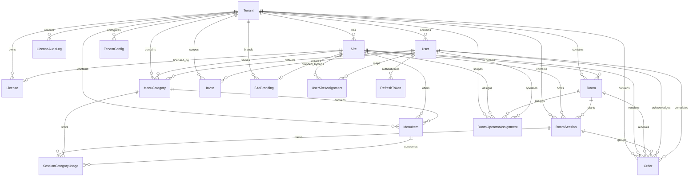

# Data Model V4

## Overview

- Scope: Meeting Room System V4.4 multi-tenant contract.
- Source of truth: `backend/prisma/schema.prisma`.
- Database: PostgreSQL.
- PK strategy: `cuid()`.
- Timestamp strategy: `TIMESTAMPTZ(3)` in UTC.
- Naming: snake_case in DB, camelCase in Prisma.
- Manual SQL required: partial unique index on `room_sessions(room_id)` where `status = 'occupied'`.
- Legacy note: if an old V3 database is reused, convert `orders.status = 'completed'` to `done` before applying the V4 contract. This repository currently assumes a fresh reset path.

## ERD



## OnDelete Strategy

| Relation | OnDelete |
| --- | --- |
| `Tenant -> Site` | `CASCADE` |
| `Tenant -> License` | `CASCADE` |
| `Tenant -> LicenseAuditLog` | `CASCADE` |
| `Tenant -> User` | `CASCADE` |
| `Tenant -> Room` | `CASCADE` |
| `Tenant -> MenuCategory` | `CASCADE` |
| `Tenant -> MenuItem` | `CASCADE` |
| `Tenant -> Order` | `CASCADE` |
| `Tenant -> RoomSession` | `CASCADE` |
| `Tenant -> TenantConfig` | `CASCADE` |
| `Tenant -> Invite` | `CASCADE` |
| `Tenant -> SiteBranding` | `CASCADE` |
| `Tenant -> RoomOperatorAssignment` | `CASCADE` |
| `Site -> License` | `SET NULL` |
| `Site -> SiteBranding` | `CASCADE` |
| `Site -> Room` | `CASCADE` |
| `Site -> MenuCategory` | `CASCADE` |
| `Site -> MenuItem` | `CASCADE` |
| `Site -> Order` | `CASCADE` |
| `Site -> RoomSession` | `CASCADE` |
| `Site -> RoomOperatorAssignment` | `CASCADE` |
| `Site -> UserSiteAssignment` | `CASCADE` |
| `Room -> RoomSession` | `CASCADE` |
| `Room -> Order` | `RESTRICT` |
| `Room -> RoomOperatorAssignment` | `CASCADE` |
| `RoomSession -> Order` | `SET NULL` |
| `RoomSession -> SessionCategoryUsage` | `CASCADE` |
| `MenuCategory -> MenuItem` | `RESTRICT` |
| `MenuCategory -> SessionCategoryUsage` | `RESTRICT` |
| `MenuCategory.defaultOperatorId -> User` | `SET NULL` |
| `MenuItem -> SessionCategoryUsage.itemId` | `SET NULL` |
| `Order.acknowledgedBy -> User` | `SET NULL` |
| `Order.completedBy -> User` | `SET NULL` |
| `User -> RefreshToken` | `CASCADE` |
| `Invite.createdBy -> User` | `RESTRICT` |

## Table Catalog

### `tenants`

| Item | Detail |
| --- | --- |
| Purpose | Tenant root entity for multi-tenant isolation and lifecycle. |
| PK | `id` |
| Unique | None |
| FK | None |
| Index | Implicit PK |
| Write path | Super-admin tenant provisioning flow; license management flow. |

### `tenant_configs`

| Item | Detail |
| --- | --- |
| Purpose | Per-tenant configuration such as timezone and SLA values. |
| PK | Composite `tenant_id + key` |
| Unique | Same as PK |
| FK | `tenant_id -> tenants.id (CASCADE)` |
| Index | `tenant_id` |
| Write path | Tenant settings API and provisioning defaults. |

### `licenses`

| Item | Detail |
| --- | --- |
| Purpose | Per-site commercial license and room entitlement. |
| PK | `id` |
| Unique | `site_id` |
| FK | `tenant_id -> tenants.id (CASCADE)`, `site_id -> sites.id (SET NULL)` |
| Index | `tenant_id` |
| Write path | License purchase, renewal, suspension, offboarding flows. |

### `license_audit_log`

| Item | Detail |
| --- | --- |
| Purpose | Audit trail for license lifecycle changes. |
| PK | `id` |
| Unique | None |
| FK | `tenant_id -> tenants.id (CASCADE)` |
| Index | `tenant_id + changed_at` |
| Write path | License admin service on every license mutation. |

### `sites`

| Item | Detail |
| --- | --- |
| Purpose | Physical site / branch owned by a tenant. |
| PK | `id` |
| Unique | None |
| FK | `tenant_id -> tenants.id (CASCADE)` |
| Index | `tenant_id` |
| Write path | Tenant onboarding and site management API. |

### `site_branding`

| Item | Detail |
| --- | --- |
| Purpose | Per-site logo, welcome copy, colors, and encrypted Wi-Fi information. |
| PK | `id` |
| Unique | `site_id` |
| FK | `tenant_id -> tenants.id (CASCADE)`, `site_id -> sites.id (CASCADE)` |
| Index | `tenant_id` |
| Write path | Site branding settings UI. |

### `rooms`

| Item | Detail |
| --- | --- |
| Purpose | Room inventory with stable `room_token` for kiosk access. |
| PK | `id` |
| Unique | `room_token`, `site_id + code` |
| FK | `tenant_id -> tenants.id (CASCADE)`, `site_id -> sites.id (CASCADE)` |
| Index | `tenant_id` |
| Write path | Room management API and provisioning scripts. |

### `room_sessions`

| Item | Detail |
| --- | --- |
| Purpose | Occupancy sessions for a room visit. |
| PK | `id` |
| Unique | Manual partial unique index `room_sessions_one_active_per_room` on `room_id` where `status = 'occupied'` |
| FK | `tenant_id -> tenants.id (CASCADE)`, `site_id -> sites.id (CASCADE)`, `room_id -> rooms.id (CASCADE)` |
| Index | `room_id + status`, `site_id + created_at` |
| Write path | Kiosk room entry flow, session reset flow, session close flow. |

### `session_category_usage`

| Item | Detail |
| --- | --- |
| Purpose | Usage ledger for category and optional item limits within a room session. |
| PK | `id` |
| Unique | `session_id + category_id + item_id` |
| FK | `session_id -> room_sessions.id (CASCADE)`, `category_id -> menu_categories.id (RESTRICT)`, `item_id -> menu_items.id (SET NULL)` |
| Index | `session_id` |
| Write path | Order placement / order validation service during limit checks. |

### `menu_categories`

| Item | Detail |
| --- | --- |
| Purpose | Orderable category definition, replacing legacy `categories`. |
| PK | `id` |
| Unique | `site_id + key` |
| FK | `tenant_id -> tenants.id (CASCADE)`, `site_id -> sites.id (CASCADE)`, `default_operator_id -> users.id (SET NULL)` |
| Index | `tenant_id` |
| Write path | Admin menu/category management UI. |

### `menu_items`

| Item | Detail |
| --- | --- |
| Purpose | Orderable menu item definition under a category. |
| PK | `id` |
| Unique | `site_id + key` |
| FK | `tenant_id -> tenants.id (CASCADE)`, `site_id -> sites.id (CASCADE)`, `category_id -> menu_categories.id (RESTRICT)` |
| Index | `tenant_id` |
| Write path | Admin menu item management UI and media upload flow. |

### `orders`

| Item | Detail |
| --- | --- |
| Purpose | Room orders and operational acknowledgement/completion state. |
| PK | `id` |
| Unique | None |
| FK | `tenant_id -> tenants.id (CASCADE)`, `site_id -> sites.id (CASCADE)`, `room_id -> rooms.id (RESTRICT)`, `session_id -> room_sessions.id (SET NULL)`, `acknowledged_by -> users.id (SET NULL)`, `completed_by -> users.id (SET NULL)` |
| Index | `tenant_id + status`, `session_id`, `site_id + status + created_at` |
| Write path | Kiosk order API, operator acknowledge flow, operator completion flow. |

### `users`

| Item | Detail |
| --- | --- |
| Purpose | Unified user table replacing legacy `admin_users`. |
| PK | `id` |
| Unique | `email`, `username` |
| FK | `tenant_id -> tenants.id (CASCADE)` |
| Index | `tenant_id` |
| Write path | Auth activation flow, invite acceptance flow, admin user management, seed bootstrap. |
| Note | `email` is nullable for legacy username-only accounts. New accounts created via invite flow (E2) must have email. |

### `user_site_assignments`

| Item | Detail |
| --- | --- |
| Purpose | Many-to-many mapping between users and sites. |
| PK | Composite `user_id + site_id` |
| Unique | Same as PK |
| FK | `user_id -> users.id (CASCADE)`, `site_id -> sites.id (CASCADE)` |
| Index | Implicit PK |
| Write path | User access scope management API. |

### `room_operator_assignments`

| Item | Detail |
| --- | --- |
| Purpose | Explicit operator coverage for rooms. |
| PK | `id` |
| Unique | `room_id + operator_user_id` |
| FK | `room_id -> rooms.id (CASCADE)`, `operator_user_id -> users.id (CASCADE)`, `site_id -> sites.id (CASCADE)`, `tenant_id -> tenants.id (CASCADE)` |
| Index | `tenant_id`, `operator_user_id`, `site_id` |
| Write path | Operator assignment management API. |

### `refresh_tokens`

| Item | Detail |
| --- | --- |
| Purpose | Rotating refresh-token store for auth sessions. |
| PK | `id` |
| Unique | `token_hash` |
| FK | `user_id -> users.id (CASCADE)` |
| Index | `user_id + revoked` |
| Write path | Login, refresh, revoke, logout-all auth flows. |

### `invites`

| Item | Detail |
| --- | --- |
| Purpose | Invite tokens for activating customer admin and operator users. |
| PK | `id` |
| Unique | `token_hash` |
| FK | `tenant_id -> tenants.id (CASCADE)`, `created_by -> users.id (RESTRICT)` |
| Index | `tenant_id + status` |
| Write path | Invite creation and invite activation flow. |

### `system_configs`

| Item | Detail |
| --- | --- |
| Purpose | Global system-level key/value configuration not scoped to a tenant. |
| PK | `key` |
| Unique | Same as PK |
| FK | None |
| Index | Implicit PK |
| Write path | System bootstrap and global admin settings. |

## Migration Notes

1. Replace `backend/prisma/schema.prisma` with the V4.4 contract.
2. Reset legacy migration history because this repository currently uses a fresh database path.
3. Generate the base migration SQL from an empty schema to the V4.4 schema.
4. Append the manual partial unique index:

```sql
CREATE UNIQUE INDEX "room_sessions_one_active_per_room"
ON "room_sessions" ("room_id")
WHERE "status" = 'occupied';
```

5. When Docker/PostgreSQL is available, run:

```bash
cd backend
npm run prisma:generate
npx prisma validate
npx prisma migrate dev --name v4_initial
```

## E1-02 Compatibility Notes

- Goal: keep backend startup, `/health`, and auth flows alive while V3-only APIs are rebuilt for V4.
- Compatibility strategy: endpoints that still depend on removed models or legacy field semantics return `503 Service Unavailable` with `code = E1_V4_COMPAT_DISABLED`.

### Temporarily Disabled Endpoints

- `GET /api/orders`
- `POST /api/orders`
- `GET /api/orders/stats`
- `PATCH /api/orders/:id/status`
- `PATCH /api/orders/:id/ai-ready`
- `GET /api/admin/orders`
- `GET /api/admin/orders/stats`
- `PATCH /api/admin/orders/:id/status`
- `PATCH /api/admin/orders/:id/ai-ready`
- `GET /api/menu`
- `POST /api/menu`
- `PATCH /api/menu/:id`
- `DELETE /api/menu/:id`
- `GET /api/admin/menu`
- `POST /api/admin/menu`
- `PATCH /api/admin/menu/:id`
- `DELETE /api/admin/menu/:id`
- `POST /api/admin/menu/:id/image`
- `GET /api/categories`
- `GET /api/admin/categories`
- `POST /api/admin/categories`
- `PATCH /api/admin/categories/:id`
- `POST /api/admin/categories/:id/image`
- `GET /api/service-counters`
- `GET /api/admin/service-counters`
- `POST /api/admin/service-counters`
- `PATCH /api/admin/service-counters/:id`
- `DELETE /api/admin/service-counters/:id`

### Still Expected To Work

- `GET /health`
- `POST /api/auth/login`
- `POST /api/admin/login`
- `GET /api/admin/me`
- `PATCH /api/admin/me/password`
- `GET /api/rooms`
- `POST /api/rooms`
- `PATCH /api/rooms/:id`
- `DELETE /api/rooms/:id`
- `GET /api/admin/rooms`
- `POST /api/admin/rooms`
- `PATCH /api/admin/rooms/:id`
- `DELETE /api/admin/rooms/:id`
